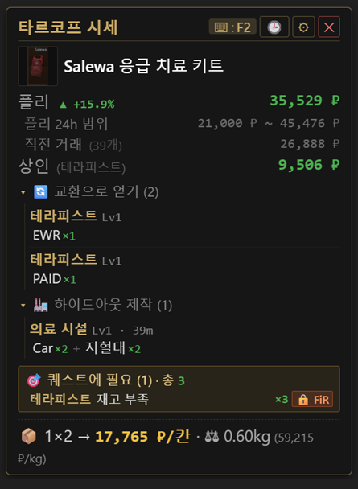
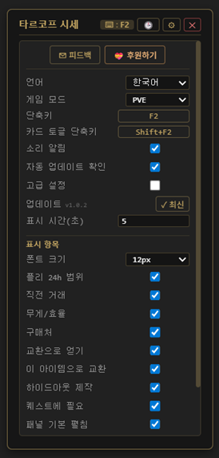
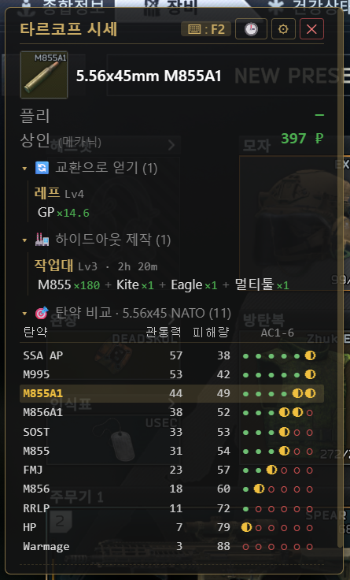
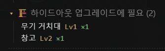
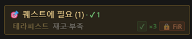
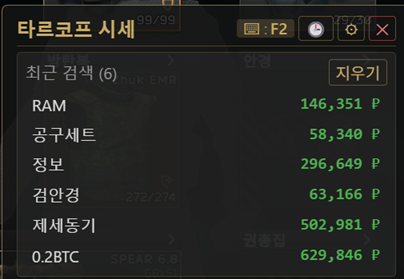

# Tarkov Price Overlay

> **타르코프에서 마우스 올리고 F2** — 플리 시세 · 상인가 · 바터 · 제작 · 퀘스트 정보를 게임 위에 바로 띄워주는 **오픈소스 무료** Windows 오버레이 앱

**[⬇ 최신 버전 다운로드](https://github.com/pado8/tarkov-price-overlay-releases/releases/latest)** · 한국어 / English

> 🔓 **소스코드 공개**: [pado8/tarkov-price-overlay](https://github.com/pado8/tarkov-price-overlay) (MIT 라이선스)
> ⚠️ **공식 다운로드는 이 페이지 한 곳뿐**입니다. 다른 곳의 다운로드 파일은 진위가 확인되지 않으니 주의하세요.

---

## 📸 실사용 화면

게임 인벤토리 위에 마우스를 올리고 F2 한 번 누르면 → 약 1초 만에 카드가 뜹니다.

플리 현재가 · 24h 범위 · 직전 거래가 · 상인 최고가 · 바터(양방향) · 하이드아웃 제작 · **퀘스트 필요 여부**까지 한 카드에. 무게 효율(₽/kg)·칸당 가격(₽/슬롯)도 자동 계산.

---

## ✨ 이런 분께

- 매번 알트탭으로 타르코프 위키나 가격 사이트 켜기 귀찮은 분
- 레이드 중 줍는 아이템이 팔만한 건지 즉석에서 판단하고 싶은 분
- 하이드아웃 / 퀘스트에 쓰이는 아이템인지 미리 알고 챙기고 싶은 분
- 바터·제작 재료 가치까지 한눈에 보고 싶은 분

---

## 🚀 기능 한눈에

| 기능 | 설명 |
|---|---|
| **F2 한 번에** | 마우스 올린 위치 캡처 → OCR → 가격 정보 표시 (1초 내외) |
| **플리 마켓** | 현재가 · 24h 범위 · 직전 거래가 · 칸당 가격 (₽/slot) |
| **상인 정보** | 최고가 상인 · 구매처 · 필요 상인 레벨 |
| **바터** | 이 아이템으로 얻는 바터 / 이 아이템이 재료인 바터 (양방향) |
| **하이드아웃 제작** | 재료로 사용되는 제작 레시피 |
| **하이드아웃 업그레이드** | 어떤 시설 Lv N 업그레이드에 이 아이템이 몇 개 필요한지 |
| **탄약 매트릭스** | 무기/탄약 캡처 시 같은 구경 탄 전체를 관통력·피해량·AC1-6으로 비교 |
| **루팅 등급** | ₽/칸 + 카파/퀘스트 가중치로 S/A/B/C/D 자동 등급 표시 |
| **땅바닥 캡처** | 인벤 호버 외에 레이드 중 땅에 떨어진 아이템도 자동 fallback 캡처 |
| **퀘스트** | 필요 퀘스트 · 수량 · FiR(인레이드) 여부 · 본인 진행 상황 자동 동기화 |
| **검색 기록** | 최근 15개 자동 저장, 클릭 한 번으로 재조회 |
| **PVP / PVE** | 게임 모드별 시세 분리 |
| **무게 효율** | ₽/kg 환산으로 운반 가치 비교 |
| **한 / 영** | UI 언어 즉시 전환 |
| **투명 오버레이** | 게임 위에 항상 표시, 자동 숨김, 위치 자유 이동 |

---

## 🛡️ 안전성 (밴 위험에 관해)

타르코프 커뮤니티에서 가장 걱정하는 부분이라 정직하게 적습니다.

### 🔓 코드 100% 공개 (오픈소스)
- 전체 소스: [github.com/pado8/tarkov-price-overlay](https://github.com/pado8/tarkov-price-overlay)
- MIT 라이선스 — 누구나 검토 · 빌드 · 포크 가능
- "메모리 안 읽음, 인젝션 없음, 텔레메트리 없음"을 **코드로 직접 확인**할 수 있습니다

### 동작 방식
이 프로그램은 **화면 캡처 + 글자 인식(OCR)** 만 사용합니다.

- ❌ 게임 프로세스 메모리 읽기/쓰기 **안 함**
- ❌ DLL 인젝션 **안 함**
- ❌ 게임 윈도우 후킹 / 키보드 저수준 후킹 **안 함**
- ❌ 게임 파일 수정 **안 함**
- ❌ 외부 서버로 데이터 전송 / 텔레메트리 **안 함** (시세 데이터는 tarkov.dev API 한 방향만)
- ✅ 일반 Win32 데스크탑 캡처(BitBlt) + 화면 위에 겹치는 투명 윈도우 + `RegisterHotKey`(OS 표준 단축키)

기술적으로는 **유튜브 녹화 프로그램이나 디스코드 화면 공유와 같은 카테고리**입니다. 메모리 핵 · ESP · 에임봇과는 완전히 다릅니다.

다만 **BSG/BattlEye가 명시적으로 허용한 도구는 아닙니다.** 정책은 언제든 바뀔 수 있으므로 사용에 따른 책임은 본인에게 있습니다. 현재까지 동일한 방식의 오버레이 도구로 밴된 사례는 보고된 바 없으나, 100% 보장은 누구도 할 수 없습니다.

---

## 📦 다운로드

**[Releases 페이지](https://github.com/pado8/tarkov-price-overlay-releases/releases/latest)** 에서 둘 중 하나를 받습니다:

- **인스톨러** (`*-x64-setup.exe`) — 설치 마법사 권장
- **포터블** (`*-portable.zip`) — 압축 풀고 `tarkov-price-overlay.exe` 바로 실행

> ⚠️ **Windows SmartScreen 경고가 뜨는 경우**
> "추가 정보" → "실행"을 눌러주세요. 코드 서명 인증서 비용 문제로 서명을 안 했을 뿐, 악성코드가 아닙니다.

---

## 🎯 사용 방법

### 1. 첫 실행

- 트레이(우측 하단)에 아이콘이 등록됩니다
- **첫 실행 시 OCR 모델 다운로드** (약 1~5분, 1회만)

### 2. 인게임에서

1. 아이템 이름이 화면에 보이게 합니다 (인벤토리 호버, 바닥 아이템 조준 등)
2. **F2** 누름
3. 잠시 후 오버레이 카드에 시세 정보가 뜸 (위 첫 스크린샷처럼)

### 3. 검색 기록 — 시계 아이콘(🕒)으로 최근 조회 다시 보기

방금 본 아이템 또 확인하고 싶을 때 캡처 다시 안 해도 됩니다. 카드 우측 상단 🕒 클릭 → 최근 15개에서 한 번 더 조회.

### 3-1. 탄약 비교 매트릭스 — 무기/탄약 캡처 시 자동 표시

무기나 탄약에 F2 누르면 같은 구경 탄 전체가 한 표로 정리됩니다. 관통력 내림차순 정렬, 현재 라운드 자동 하이라이트.

- **관통력 (Pen)**: 방탄을 뚫는 능력 — AC1-6 도트로 시각화 (● 확실히 / ◐ 운빨 / ○ 못 뚫음)
- **피해량 (Dmg)**: 한 발당 데미지 (방탄 뚫었을 때 기준)
- 트레이더에서 탄 살 때, 레이드에서 주운 탄 쓸만한지 즉시 판단

### 3-2. 하이드아웃 업그레이드 재료 — 시설별 필요 개수 표시

이 아이템이 어떤 하이드아웃 시설 업그레이드에 쓰이는지 카드에 자동 표시.

"무기 거치대 Lv1 ×1", "창고 Lv2 ×1" 같이 시설명 + 레벨 + 필요 개수를 한 줄로. 보관함에 모셔둘지 팔지 결정에 도움.

### 3-3. 퀘스트 자동 동기화 — 본인 진행 상황 즉시 인식

EFT 게임 로그를 직접 파싱해서 본인이 어떤 퀘스트를 완료/진행 중인지 시세 카드의 퀘스트 패널에 자동 표시.

- ✓ 완료 (회색) / ▶ 진행중 (골드) / 미시작 (일반) 3단계 색상 구분
- 외부 API/토큰 불필요 — 파일 읽기만 사용 (안전)
- 설정 → 퀘스트 동기화에서 EFT 설치 경로 + 표시 모드 변경 가능

### 4. 인식이 잘 안 될 때

설정의 **캡처 영역** 항목에서 X/Y 오프셋과 너비/높이를 조정 — 아이템 이름 텍스트가 캡처 영역 안에 들어오도록 맞추면 됩니다.

| 설정 | 기본값 | 의미 |
|---|---|---|
| X 오프셋 | `10` | 마우스 커서 기준 가로 시작점 (px) |
| Y 오프셋 | `-75` | 마우스 커서 기준 세로 시작점 (px) |
| 너비 | `300` | 캡처 영역 너비 |
| 높이 | `70` | 캡처 영역 높이 |

### 5. 오버레이 위치 이동

카드 빈 곳을 **드래그**하면 어디든 옮길 수 있습니다 (위치 자동 저장).

---

## ⚙️ 설정 & 커스터마이징

기어(⚙) 아이콘 클릭하면 설정창이 펼쳐집니다.

| 항목 | 설명 |
|---|---|
| 언어 | 한국어 / English |
| 게임 모드 | PVP / PVE (가격 데이터가 분리되어 있음) |
| 단축키 | 가격 조회 단축키 (기본 `F2`) |
| 카드 토글 단축키 | 오버레이 표시/숨김 (기본 `Shift+F2`) |
| 소리 알림 | 조회 완료 시 띵 소리 |
| 표시 시간(초) | 카드 자동 숨김까지 대기 시간 (1~60초) |
| 폰트 크기 | 12px ~ 20px |
| 표시 항목 | 24h 범위 / 직전 거래 / 무게 효율 / 구매처 / 바터 / 제작 / 하이드아웃 업그레이드 / 퀘스트 개별 ON/OFF |
| 패널 기본 펼침 | 바터·제작·퀘스트 패널을 처음부터 펼쳐서 표시 |
| 자동 업데이트 확인 | 실행 시 새 버전 자동 확인 |
| 고급 설정 | OCR 오인식 직접 교정 (`misread → correct name` 매핑 저장) |

표시 항목 다 끄면 카드가 거의 비어보일 만큼 미니멀하게, 다 켜면 위 첫 스크린샷처럼 풀 정보로 — 본인 플레이 스타일 맞게 조정.

---

## ❓ 자주 묻는 질문

**Q. F2를 눌러도 아무 반응이 없어요.**
A. 첫 실행 후 OCR 모델 다운로드 중일 수 있습니다 (최대 5분). 이후에도 안 되면 설정에서 단축키를 다시 등록해보세요. 다른 프로그램이 F2를 점유하면 충돌할 수 있으니 다른 키로 변경도 시도해보세요.

**Q. 바탕화면에선 F2 잘 되는데 타르코프 안에서만 무반응이에요.**
A. 권한 차이 때문입니다. 타르코프는 BattlEye가 **관리자 권한**으로 실행시키는데, 본 앱은 일반 권한이라 Windows UIPI 정책에 의해 게임 포커스 상태에서 키 입력이 차단됩니다.

**해결**: `tarkov-price-overlay.exe` 또는 바로가기 **우클릭 → "관리자 권한으로 실행"** 해주세요. 매번 누르기 귀찮으시면 바로가기 속성 → 호환성 → "관리자 권한으로 이 프로그램 실행" 체크해두면 더블클릭만으로 항상 관리자 권한으로 뜹니다.

(메모리 후킹/저수준 키 후킹으로 우회 가능하지만 BattlEye 탐지 위험 때문에 안 합니다. 안전한 방식 유지하면서 작동시키려면 권한 맞춰주는 게 정답이에요.)

추가로, 타르코프 그래픽 설정이 **독점 전체화면(Exclusive Fullscreen)** 일 경우는 그래픽 설정에서 **"테두리 없는 전체화면(Borderless Fullscreen)"** 으로도 바꿔주세요. 독점 전체화면은 OS 자체가 모든 외부 오버레이를 차단해서 어떤 도구도 동작 못 합니다.

**Q. 인식이 잘 안 되거나 엉뚱한 아이템이 나와요.**
A. 위 "캡처 영역" 부분 참조. 아이템 이름 텍스트만 캡처 박스 안에 들어오도록 X/Y 오프셋을 미세 조정하세요.

**Q. 같은 아이템을 자꾸 잘못 읽어요.**
A. 설정 → **고급 설정** ON → 오인식 → 정답 매핑을 저장할 수 있습니다. 다음번부터 자동 보정.

**Q. PVE인데 가격이 이상해요.**
A. 설정 → **게임 모드**를 PVE로 변경하세요.

**Q. 듀얼 모니터 / 4K / 125% 배율인데 좌표가 이상해요.**
A. Per-monitor DPI 처리되어 있어 동작합니다. 그래도 어긋나면 캡처 영역 X/Y 오프셋으로 보정하세요.

**Q. 설치 시 SmartScreen / 백신 경고가 떠요.**
A. 코드 서명 인증서 미적용 때문입니다. "추가 정보 → 실행"으로 진행하세요. 자세한 동작 원리는 위 "안전성" 섹션 참조.

**Q. 밴 안 당하나요?**
A. 위 "안전성" 섹션 참조. 화면 캡처 + OCR 방식이라 메모리 핵·ESP와는 완전히 다른 카테고리입니다. 단, BSG가 명시 허용한 건 아니므로 사용 책임은 본인에게 있습니다.

**Q. X 누르면 어디로 가나요?**
A. 트레이로 숨김. 다시 띄우려면 F2 또는 트레이 아이콘 클릭. 완전 종료는 트레이 아이콘 우클릭 → 종료.

**Q. 의견·버그 제보는 어디에 하나요?**
A. [GitHub Issues](https://github.com/pado8/tarkov-price-overlay-releases/issues) 또는 이메일 floe9235@gmail.com

---

## 📜 업데이트 내역 (요약)

- **v1.0.8** — QHD/4K 해상도 자동 스케일링 + 캡처 영역 **라이브 미리보기** (빨간/노란 박스가 커서 따라다님) + 슬라이더 + 텍스트 편집 UI + 설정 패널 드래그 리사이즈 + 정크 OCR 빠른 차단 (2분 멈춤 → 1초 내) + 디자인 토큰 통일 (회색 톤 가독성 ↑, 한글 폰트 명시)
- **v1.0.7** — 탄약 매트릭스 패널(무기/탄약 캡처 시 같은 구경 비교표 자동 표시) + 땅바닥 아이템 캡처 fallback + shortName 영문 약자 매칭 + 루팅 등급 D/C/B/A/S 뱃지 + 1×1 아이템도 칸성비/등급 표시 + 관리자 권한 경고 배너
- **v1.0.6** — 퀘스트 트래커 라이브 EFT(BSG 런처) 인식 픽스 + 시세 카드에 "하이드아웃 업그레이드 재료" 패널 추가 (어떤 시설 Lv N에 몇 개 필요한지)
- **v1.0.5** — 퀘스트 자동 동기화 (EFT 게임 로그 직접 파싱) + 포터블 README 인코딩 픽스 + 전체화면 FAQ 보강
- **v1.0.4** — 카드 자동 숨김 시 스크롤바 잔존 / X 종료 후 F2 안 됨 / 트레이 알림 매번 떠서 거슬림 등 UX 버그 픽스 묶음
- **v1.0.3** — 게임모드 표기 'PVP (일반)' → 'PVP' 단순화 + README 정리
- **v1.0.2** — 후원 패널에 PayPal 탭 추가 (해외 유저용)
- **v1.0.1** — 폰트 크기 변경 시 카드 잘리던 문제 픽스, 폰트 12-20px 범위 + 저작권 표시
- **v1.0.0** — 정식 출시 (커뮤니티 배포 시작)

전체 변경 내역: [Releases 페이지](https://github.com/pado8/tarkov-price-overlay-releases/releases)

---

## 💝 후원

개발이 도움 되셨다면 후원 부탁드립니다. 앱의 설정 → 후원하기에서 두 가지 방법 중 선택할 수 있어요:

- **카카오페이** (한국)
- **PayPal** — [paypal.me/tarkovoverlay](https://paypal.me/tarkovoverlay) (해외)

---

## 📜 라이선스 / 면책

- 가격 데이터: [tarkov.dev](https://tarkov.dev) (커뮤니티 운영 EFT DB)
- 본 도구는 비공식 도구이며 **Battlestate Games와 무관**합니다
- *Escape from Tarkov* 및 관련 자산은 Battlestate Games Limited의 상표/저작권입니다
- © 2026 pado

---

# Tarkov Price Overlay — English Guide

> **Hover an item in Tarkov, press F2** — a free, **open-source** Windows overlay that shows flea market prices, trader prices, barters, crafts, and quest requirements on top of the game.

**[⬇ Download Latest](https://github.com/pado8/tarkov-price-overlay-releases/releases/latest)** · Free · Windows

> 🔓 **Source code is fully open**: [pado8/tarkov-price-overlay](https://github.com/pado8/tarkov-price-overlay) (MIT license)
> ⚠️ **This Releases page is the only official download.** Files hosted elsewhere have not been verified — please don't run those.

---

## 📸 In Action

Hover an inventory item, press F2 — card appears in about a second.

Flea current/24h range/last trade · top trader price · barters (both directions) · hideout crafts · **quest requirements** all in one card. Weight efficiency (₽/kg) and per-slot price (₽/slot) auto-calculated.

---

## ✨ Who is this for?

- Tired of alt-tabbing to wiki/price sites every time you pick up loot
- Want to instantly judge whether a found item is worth selling
- Need to know if an item is used in hideout / quest before vendoring it
- Want barter/craft material values at a glance

---

## 🚀 Features

| Feature | Description |
|---|---|
| **One-key lookup** | Hover, press F2, see prices in ~1 second |
| **Flea market** | Current price · 24h range · last trade · ₽/slot |
| **Trader info** | Best trader price · buy-from vendors · required trader level |
| **Barter** | Both directions — barters that produce / consume this item |
| **Hideout crafts** | Recipes that use this item as an ingredient |
| **Hideout upgrade reqs** | Which station / level upgrade needs this item, and how many |
| **Ammo matrix** | On weapon/ammo lookup, compare every round in the caliber by Pen/Dmg/AC1-6 |
| **Loot tier** | Auto-graded S/A/B/C/D badge from ₽/slot + Kappa/quest weighting |
| **Ground capture** | Auto-fallback to small near-cursor box for dropped items in raid |
| **Quest info** | Required quests · quantity · FiR status · auto-sync your own progress |
| **History** | Last 15 lookups auto-saved, click to re-query |
| **PVP / PVE** | Separate price data per game mode |
| **Weight efficiency** | ₽/kg conversion to compare carry value |
| **Korean / English** | Switch UI language instantly |
| **Transparent overlay** | Always-on-top, auto-hide, freely draggable |

---

## 🛡️ Safety (about ban risk)

The biggest concern in the Tarkov community, so to be straight with you:

### 🔓 Source code is 100% open
- Full source: [github.com/pado8/tarkov-price-overlay](https://github.com/pado8/tarkov-price-overlay)
- MIT license — anyone can audit, build, or fork
- "No memory access, no injection, no telemetry" is **verifiable from the code itself**

### How it works
This program uses **screen capture + OCR (text recognition) only**.

- ❌ Does **NOT** read/write game process memory
- ❌ Does **NOT** inject DLLs
- ❌ Does **NOT** hook the game window or use low-level keyboard hooks
- ❌ Does **NOT** modify any game files
- ❌ Does **NOT** send any data to external servers / telemetry (price queries hit tarkov.dev API only)
- ✅ Uses standard Win32 desktop capture (BitBlt) + a transparent topmost window + `RegisterHotKey` (OS-level hotkey)

Technically this is **the same category as YouTube screen recorders or Discord screen sharing**. It is fundamentally different from memory hacks, ESP, or aimbots.

That said, **this tool is not officially sanctioned by BSG/BattlEye**. Their policy can change, so use is at your own risk. No bans have been reported for similar OCR-based overlay tools to date, but no one can guarantee 100% safety.

---

## 📦 Download

Grab one from **[Releases](https://github.com/pado8/tarkov-price-overlay-releases/releases/latest)**:

- **Installer** (`*-x64-setup.exe`) — recommended
- **Portable** (`*-portable.zip`) — extract and run `tarkov-price-overlay.exe`

> ⚠️ **Windows SmartScreen warning**
> Click "More info" → "Run anyway". The executable is unsigned (cost reasons), but contains no malware.

---

## 🎯 How to Use

### 1. First launch

- Runs in the **system tray** (bottom-right)
- **First launch downloads the OCR model** (1–5 min, one-time)

### 2. In-game

1. Make the item name visible on screen (hover inventory, aim at ground item, etc.)
2. Press **F2**
3. Overlay card appears with prices

### 3. Recent lookups — click the 🕒 icon

Want to recheck something you just looked up? Click 🕒 in the card header to see the last 15 lookups; click any entry to re-query.

### 3-1. Ammo compare matrix — auto-shown on weapons/rounds

Press F2 on any weapon or ammunition round and the full set of rounds in that caliber pops up in a compact table. Sorted by penetration descending, current round highlighted.

- **Pen**: Penetration Power — visualized as AC1-6 dots (● reliable / ◐ variable / ○ unlikely)
- **Dmg**: Damage per shot (when penetrated)
- Useful for buying from traders or judging looted ammo on the fly

### 3-2. Hideout upgrade materials — what stations need this item

The lookup card auto-shows which hideout stations require this item for their level upgrades.

Each line shows station + level + required count (e.g. "Weapon rack Lv1 ×1"). Helps decide whether to stash or sell.

### 3-3. Quest auto-sync — instant in-game progress detection

The card's quest panel auto-marks which quests you've already completed / are currently progressing by parsing EFT's game logs directly.

- ✓ completed (grey) · ▶ in progress (gold) · not started (default) — three-tier color
- No external API or token required — only reads local files
- Settings → Quest sync to point at your EFT install or change display mode

### 4. If recognition is off

Adjust the **capture region** in settings — make sure only the item name text falls inside the capture box.

**New in v1.0.8:**
- 🔴 red box (primary) + 🟡 yellow box (ground) follow your cursor as a **live preview** on top of the game
- Sliders + click-to-type numbers for offsets and sizes
- "Auto-scale to monitor" button — one-click QHD/4K correction

| Setting | Default (1080p) | Meaning |
|---|---|---|
| X offset | `10` | Horizontal start from cursor (px) |
| Y offset | `-75` | Vertical start from cursor (px) |
| Width | `300` | Capture area width |
| Height | `70` | Capture area height |

> QHD/4K users get auto-scaled defaults on first launch. If they don't fit, hit Settings → Capture region → Edit → "Auto-scale to monitor".

### 5. Move the overlay

Drag any blank area of the card to reposition. Position is auto-saved.

---

## ⚙️ Settings & Customization

Click the gear (⚙) icon to open settings.

| Setting | Description |
|---|---|
| Language | Korean / English |
| Game mode | PVP / PVE (price data is separated) |
| Hotkey | Lookup hotkey (default `F2`) |
| Toggle card hotkey | Show/hide overlay (default `Shift+F2`) |
| Sound notification | Ding on lookup complete |
| Hide delay | Auto-hide delay (1–60 seconds) |
| Font size | 12px – 20px |
| Display items | Toggle each section: 24h range, last trade, weight/efficiency, buy from, barters, crafts, hideout upgrade reqs, quests |
| Panels open by default | Expand barter/craft/quest panels on first render |
| Auto update check | Check for new versions on startup |
| Advanced mode | OCR correction editor (`misread → correct name` mappings) |

Turn everything off → minimal card showing just price. Turn everything on → rich card like the first screenshot. Tune to your playstyle.

---

## ❓ FAQ

**Q. Nothing happens when I press F2.**
A. The OCR model may still be downloading on first launch (up to 5 min). If it still fails, re-register the hotkey in Settings. Another program might be holding F2 — try a different key.

**Q. F2 works on desktop but does nothing inside Tarkov.**
A. Privilege mismatch. Tarkov runs as **administrator** (BattlEye requires it), but this app runs as a normal user. Windows UIPI (User Interface Privilege Isolation) blocks key delivery to lower-privilege processes while a higher-privilege window has focus.

**Fix**: Right-click `tarkov-price-overlay.exe` (or its shortcut) → **"Run as administrator"**. To avoid clicking through this every launch, set the shortcut's Properties → Compatibility → "Run this program as an administrator".

If you're in **Exclusive Fullscreen**, switch Tarkov's graphics setting to **"Borderless Fullscreen"** as well — exclusive fullscreen blocks every overlay tool at the OS level, regardless of privilege.

**Q. Wrong item name or "no match" result.**
A. See "capture region" above. Tune X/Y offset so only the item name is inside the capture box.

**Q. Same item keeps getting misread.**
A. Settings → enable **Advanced mode** → save a `misread → correct name` mapping. Auto-applied next time.

**Q. PVE prices look wrong.**
A. Switch **Game mode** to PVE in Settings.

**Q. Dual monitor / 4K / 125% scaling — coordinates are off.**
A. Per-monitor DPI is handled. If still off, fine-tune capture X/Y offset.

**Q. SmartScreen / antivirus flags it.**
A. Unsigned executable. Click "More info → Run anyway". See "Safety" section for technical details.

**Q. Will I get banned?**
A. See "Safety" section above. Screen capture + OCR is fundamentally different from memory hacks/ESP. That said, BSG has not officially sanctioned this tool, so use at your own risk.

**Q. Where does the X button go?**
A. Hides to the system tray. Press F2 or click the tray icon to bring it back. Right-click the tray icon → Exit to fully quit.

**Q. Bug reports / feedback?**
A. Open a [GitHub Issue](https://github.com/pado8/tarkov-price-overlay-releases/issues) or email floe9235@gmail.com.

---

## 📜 Changelog (recent)

- **v1.0.8** — QHD/4K auto-scaling on first launch + **live preview rectangles** (red/yellow boxes follow cursor) for the capture-region editor + slider-with-text fields + drag-resizable settings panel + fast junk-OCR rejection (2-minute hang → instant empty) + design-token cleanup (brighter greys for transparent-mode readability, explicit Korean font fallback)
- **v1.0.7** — Ammo matrix panel (auto-compare table on weapon/ammo lookup) + ground item capture fallback + shortName alias matching + loot tier D/C/B/A/S badge + 1×1 items show ₽/slot and tier + admin elevation warning banner
- **v1.0.6** — Tracker now recognizes live EFT (BSG launcher) install layout. New "Hideout upgrade requirements" panel on the lookup card.
- **v1.0.5** — Quest auto-sync via EFT log parsing. Portable README encoding fix. Fullscreen FAQ.
- **v1.0.4** — Fixes: scrollbar lingering after auto-hide, F2 not working after X-to-tray, tray notification spamming on every X click, etc.
- **v1.0.3** — Game mode label simplified to 'PVP', README polish
- **v1.0.2** — PayPal donate tab added (international users)
- **v1.0.1** — Font-size-change card cropping fixed, font range 12–20px, copyright notice
- **v1.0.0** — Public release

Full history: [Releases](https://github.com/pado8/tarkov-price-overlay-releases/releases)

---

## 💝 Donate

If this helps you, donations are appreciated. Two options in Settings → Donate:

- **KakaoPay** (Korea)
- **PayPal** — [paypal.me/tarkovoverlay](https://paypal.me/tarkovoverlay) (international)

---

## 📜 License / Disclaimer

- Price data: [tarkov.dev](https://tarkov.dev) (community-maintained EFT database)
- This is an **unofficial tool, not affiliated with Battlestate Games**
- *Escape from Tarkov* and related assets are trademarks/copyright of Battlestate Games Limited
- © 2026 pado
